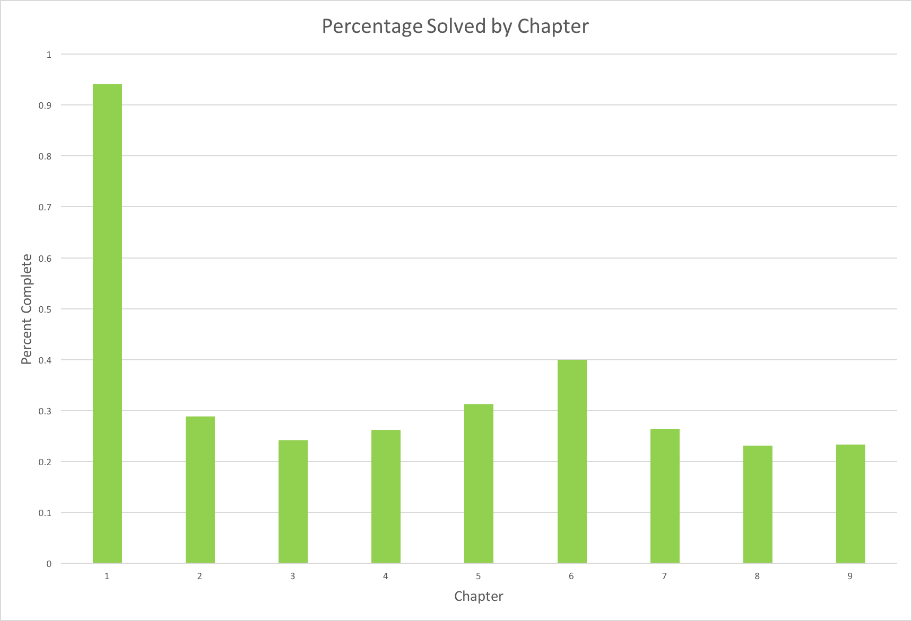

# Algorithm_Exercises

In this repo are my solutions to some of the exercises from Steven Skiena’s Algorithm Design Manual. My goal, unless I later decide otherwise, is to solve all of them.

Note that many of the problems involve implementing the solution in code (I usually use Python), but there are separately numbered "Programming Challenges" that must be implemented in C and can be submitted online for automated judging. There are 42 of them, and I believe they are derived from another book by Skiena. I intend to do these as well, but haven't started yet.

## Progress

**Chapter 1: Introduction to Algorithm Design** - 31 solved out of 34 = 91%  
**Chapter 2: Algorithmic Analysis** - 13 solved out of 52 = 25%  
**Chapter 3: Data Structures** - 7 solved out of 29 = 24%  
**Chapter 4: Sorting and Searching** - 12 solved out of 46 = 26%  
**Chapter 5: Graph Traversal** - 10 solved out of 32 = 31%  
**Chapter 6: Weighted Graph Algorithms** - 10 solved out of 25 = 40%  
**Chapter 7: Combinatorial Search and Heuristic Methods** - 5 solved out of 19 = 26%  
**Chapter 8: Dynamic Programming** - 6 solved out of 26 = 23%  
**Chapter 9: Intractable Problems and Approximation Algorithms** - 7 solved out of 30 = 23%  

**Total:** 101 solved out of 293 = 34%

