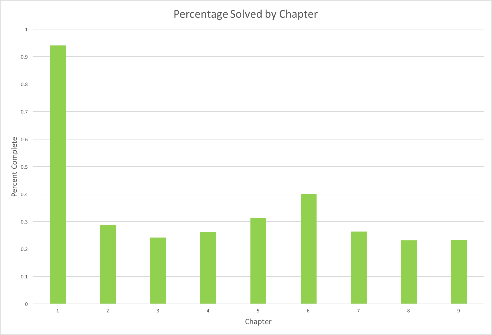

# Algorithm_Exercises

In this repo are my solutions to some of the exercises from Steven Skiena’s Algorithm Design Manual.

## Progress

**Chapter 1: Introduction to Algorithm Design** - 32 solved out of 34 = 94%  
**Chapter 2: Algorithmic Analysis** - 15 solved out of 52 = 29%  
**Chapter 3: Data Structures** - 7 solved out of 29 = 24%  
**Chapter 4: Sorting and Searching** - 12 solved out of 46 = 26%  
**Chapter 5: Graph Traversal** - 10 solved out of 32 = 31%  
**Chapter 6: Weighted Graph Algorithms** - 10 solved out of 25 = 40%  
**Chapter 7: Combinatorial Search and Heuristic Methods** - 5 solved out of 19 = 26%  
**Chapter 8: Dynamic Programming** - 6 solved out of 26 = 23%  
**Chapter 9: Intractable Problems and Approximation Algorithms** - 7 solved out of 30 = 23%  

**Total:** 104 solved out of 293 = 35%

